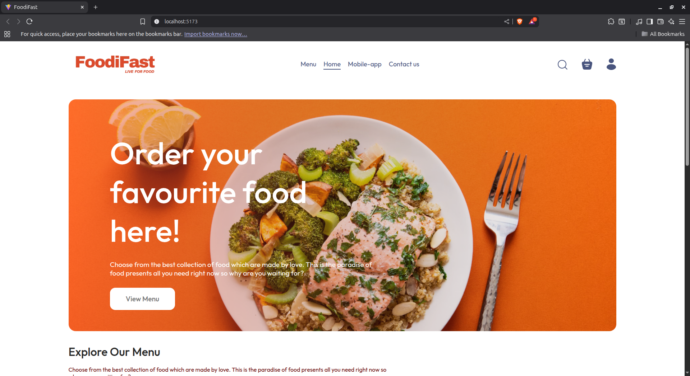
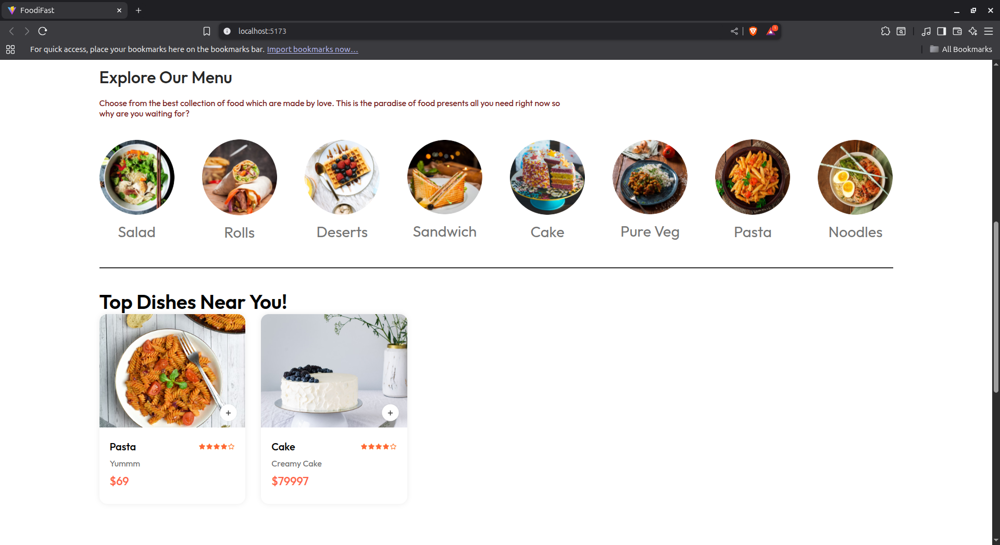
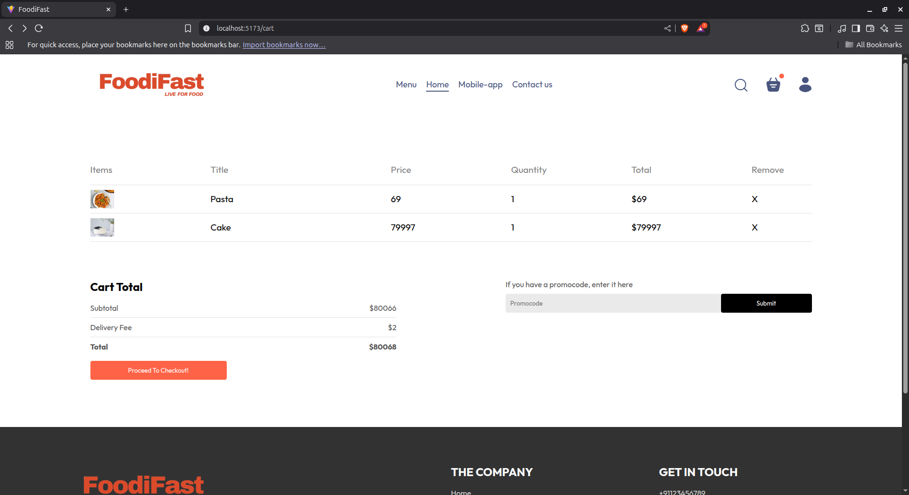
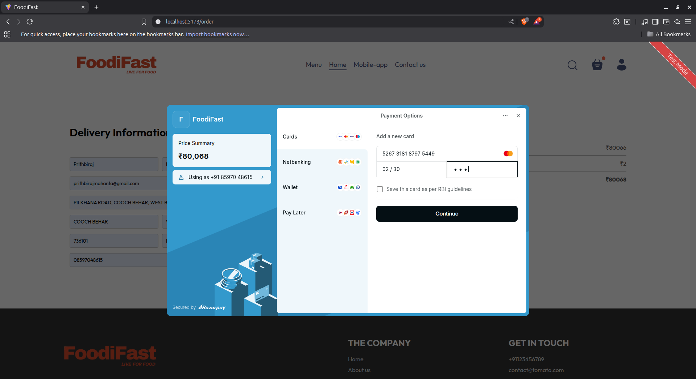
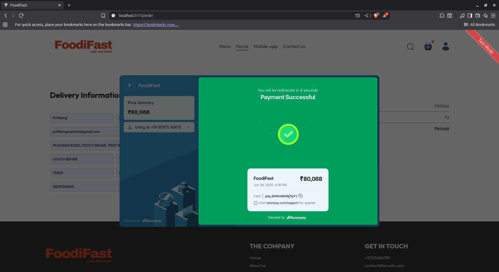

# 🍔 FoodiFast – Online Food Delivery Application

**FoodiFast** is a modern full-stack food delivery web application built using the **MERN stack** (MongoDB, Express.js, React.js, Node.js). Designed with simplicity and speed in mind, it offers users an intuitive interface to explore, select, and order food online. While it draws inspiration from platforms like **Swiggy** and **Zomato**, it introduces a unique touch with its own design and integrated payment flow via **Stripe**.

---

## 🚀 Live Demo

> Coming soon on [Vercel](https://vercel.com/)

---

## 📖 Project Overview

FoodiFast enables users to:
- Browse food items by category
- Add items to cart
- Make secure payments via Stripe
- View order success page

The system also includes an **Admin Dashboard** to manage food items.

---

## 📁 Project Structure

```bash
FoodiFast/
│
├── admin/                  # Admin dashboard (React + Vite)
│   ├── node_modules/
│   ├── public/
│   ├── src/
│   ├── .gitignore
│   ├── eslint.config.js
│   ├── index.html
│   ├── package.json
│   ├── package-lock.json
│   ├── vite.config.js
│   └── README.md
│
├── backend/                # Express.js backend
│   ├── config/             # DB and app config
│   ├── controllers/        # Route handlers / business logic
│   ├── middleware/         # Custom middleware functions
│   ├── models/             # MongoDB schemas
│   ├── routes/             # API route definitions
│   ├── uploads/            # Uploaded assets or food images
│   ├── node_modules/
│   ├── .env                # Environment variables
│   ├── package.json
│   ├── package-lock.json
│   └── server.js           # Entry point for backend
│
├── frontend/               # User-facing React frontend
│   ├── node_modules/
│   ├── public/
│   ├── src/
│   ├── .gitignore
│   ├── eslint.config.js
│   ├── index.html
│   ├── package.json
│   ├── package-lock.json
│   ├── vite.config.js
│   └── README.md


```


## 📸 Screenshots

> Replace these with your actual image links.







---

## 🛠️ Tech Stack

- **Frontend**: React.js, **Pure CSS**
- **Backend**: Node.js, Express.js
- **Database**: MongoDB (Atlas)
- **Payment Integration**: Stripe
- **API Testing**: Postman (optional)
- **Deployment (Planned)**: Vercel (Frontend), Render/Heroku (Backend)

---

## ✅ Core Features

- 🔍 Browse food items by category
- 🛒 Add and remove items from cart
- 👤 User authentication (login/signup)
- 💳 **Stripe-based payment gateway**
- 📦 Order confirmation flow with success screen
- 🌐 Fully responsive design across all devices

---

## 📦 Getting Started

### Clone the Repository

```bash
git clone https://github.com/prithbi777/FoodiFast.git
cd FoodiFast
